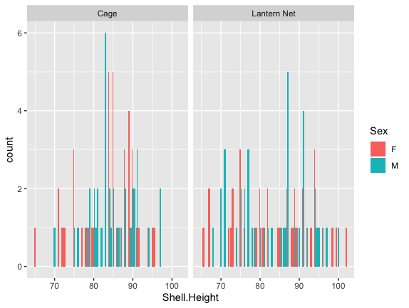
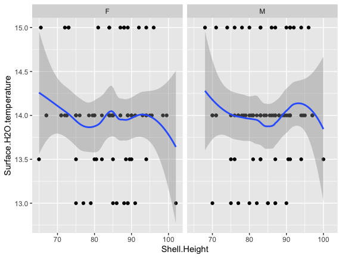
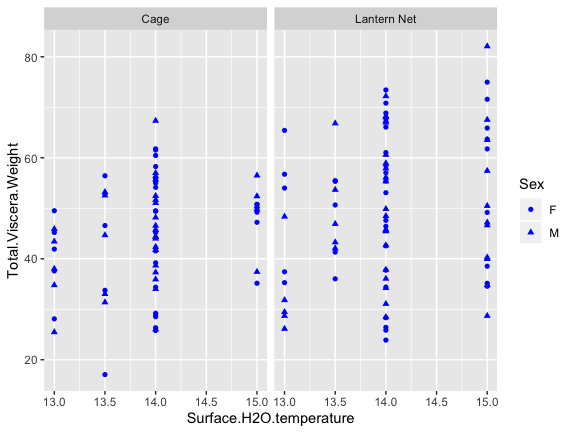

# DATA EXPLORATION
###### SWETHA BYLUPPALA
--------

The following R plots were created using the data from the document Copy of GSI Data Sheet.xlsx.

####### Shell Height vs Cage

 

 This graphs shows how the shell hieghts differ in gear types, which here are Cage and Lantern Nets. This also shows the numbers differed by sex of scallops. It could be observed that male scallops around the heights of 80 to 85 show higher number in cages than in lantern nets.
 
 ####### Surface Temperature vs shell height vs Sex
 
  
 
 This graphs shows the growth of scallops in terms of shell height in varied temperatures and the differences in growth rate in male and female scallops. It could be observed that male and female scallops do not follow the same growth pattern at similar temperatures.
 
 ####### Surface Temperature vs Total Viscera Weight vs Gear Type vs Sex
 
   
  
  This graphs shows the growth of scallops in terms of weight at different temperatures for male and female scallops. It could be observed that more heavier scallops are observed at the temperature of 14 celcius in Lantern nets than in cages.
